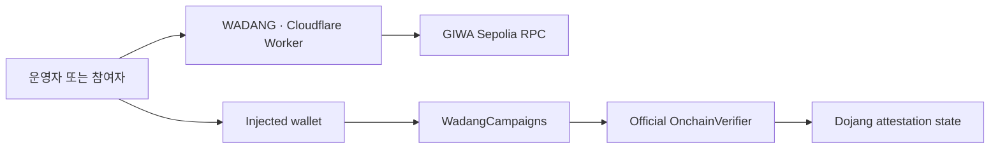

# WADANG MVP specification

## System boundary

The browser talks directly to an injected wallet and GIWA Sepolia RPC. Dojang supplies verification state; `WadangCampaigns` owns participation rules and entry state; a connected app can read `isEligible` as an access condition. The Cloudflare Worker serves UI and submission artifacts but owns no identity, permission, campaign, or entry state.



## Contract semantics

- Campaign IDs are one-based and monotonically increasing.
- Creation requires a non-empty title of at most 80 UTF-8 bytes, details of at most 280 bytes, a future end, `startsAt < endsAt`, and capacity 1–10,000.
- Entry is allowed at `startsAt` and rejected at `endsAt`.
- Entry succeeds only before capacity, once per wallet, and when the configured verifier returns true for the caller and attester.
- Verifier errors propagate; they are not interpreted as success or ordinary non-verification.
- Only the organizer may cancel; cancellation is irreversible.
- `hasClaimed` preserves history. `isEligible` additionally requires an uncancelled campaign and current verification.
- The contract has no payable function, token transfer, admin, proxy, pause, arbitrary call, or reward fulfillment.

## Public interface

```solidity
constructor(address verifier, bytes32 attesterId)
createCampaign(string title, string details, uint64 startsAt, uint64 endsAt, uint32 capacity)
claim(uint256 campaignId)
cancelCampaign(uint256 campaignId)
getCampaign(uint256 campaignId)
hasClaimed(uint256 campaignId, address account)
isEligible(uint256 campaignId, address account)
```

`CampaignCreated` is parsed from the confirmed receipt to build `/madang/{id}`. Guessing `campaignCount + 1` in the UI is forbidden because concurrent creation can make it wrong.

## Attester and deployment gate

- Chain ID: `91342`
- RPC: `https://sepolia-rpc.giwa.io`
- Explorer: `https://sepolia-explorer.giwa.io`
- Official verifier: `0xd5077b67dcb56caC8b270C7788FC3E6ee03F17B9`

`pnpm check:attesters <PLAYGROUND_WALLET>` reads UPBIT KOREA and TESTNET FAUCET candidates. Exactly one true result is required. Zero or two matches stop deployment pending GIWA confirmation. A mock is local-test-only.

## Testnet E2E evidence

- **V — organizer/deployer/participant:** one dedicated Playground-verified wallet, test ETH only.
- **U — unverified caller:** deterministic address used only for `eth_call`/simulation; it owns no key and sends no transaction.

Required public evidence: V creates campaign 1 and enters; `isEligible` returns true; duplicate and U entry are rejected in accurately labeled simulations; V creates and closes campaign 2; U close is rejected in simulation. Exhaustive time/capacity/revocation behavior remains deterministic in local contract tests.

The release uses the TESTNET FAUCET attester selected by the Playground wallet. It must never be described as UPBIT KOREA KYC or production identity evidence.

## Rollback

- A deployed contract cannot be deleted. Deploy a corrected contract and mark the old address deprecated in evidence and UI configuration.
- Roll Cloudflare back to the last verified deployment or delete the Worker.
- Never reuse a key exposed in logs or media; abandon the dedicated testnet wallet immediately.
