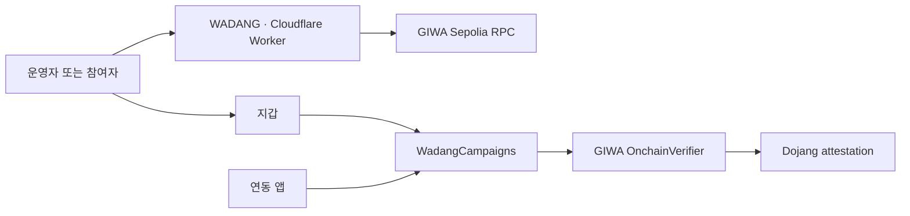

# WADANG MVP 명세

## 시스템 구조

브라우저가 지갑과 GIWA Sepolia RPC에 직접 연결합니다. Dojang은 지갑의 검증 정보를 제공하고, `WadangCampaigns`는 참여 규칙과 이력을 관리합니다. 연동 앱은 `isEligible`을 접근 조건으로 사용할 수 있습니다. Cloudflare Worker는 화면과 제출용 정적 문서만 제공합니다.



## 컨트랙트 규칙

- 캠페인 ID는 1부터 순서대로 증가합니다.
- 제목은 1–80 UTF-8 bytes, 안내문은 최대 280 bytes입니다.
- 정원은 1–10,000이며 시작 시각은 종료 시각보다 빨라야 합니다.
- 시작 시각은 참여 가능 범위에 포함하고 종료 시각은 포함하지 않습니다.
- 참여 시 설정된 verifier와 attester가 현재 지갑을 검증해야 합니다.
- 같은 지갑은 한 캠페인에 한 번만 참여할 수 있습니다.
- verifier 호출 오류는 성공이나 단순 미인증으로 바꾸지 않고 그대로 전파합니다.
- 캠페인을 만든 운영자만 취소할 수 있으며 취소는 되돌릴 수 없습니다.
- `hasClaimed`는 과거 참여 기록을 보존합니다.
- `isEligible`은 과거 참여, 캠페인 취소 여부와 조회 시점의 인증을 함께 확인합니다.
- 자금, 토큰, 관리자, 프록시, 일시정지와 임의 호출 기능은 없습니다.

## 공개 인터페이스

```solidity
constructor(address verifier, bytes32 attesterId)
createCampaign(string title, string details, uint64 startsAt, uint64 endsAt, uint32 capacity)
claim(uint256 campaignId)
cancelCampaign(uint256 campaignId)
getCampaign(uint256 campaignId)
hasClaimed(uint256 campaignId, address account)
isEligible(uint256 campaignId, address account)
```

화면은 확정된 영수증의 `CampaignCreated` 이벤트에서 캠페인 ID를 읽어 `/madang/{id}` 링크를 만듭니다. `campaignCount + 1`을 미리 추측하지 않습니다.

## GIWA Sepolia 설정

- Chain ID: `91342`
- RPC: `https://sepolia-rpc.giwa.io`
- Explorer: `https://sepolia-explorer.giwa.io`
- OnchainVerifier: `0xd5077b67dcb56caC8b270C7788FC3E6ee03F17B9`
- Playground TESTNET FAUCET attester: `0xaa92f8c143657dde575de430aecaea6ca91f2e6072339b16932d426895d8d678`

`pnpm check:attesters <PLAYGROUND_WALLET>`는 UPBIT KOREA와 TESTNET FAUCET 후보를 읽습니다. 정확히 하나가 `true`일 때 해당 ID를 사용합니다.

## 테스트넷 증거

- 전용 Playground 인증 지갑이 캠페인 1을 생성하고 참여합니다.
- 참여 후 `isEligible`이 `true`인지 확인합니다.
- 미인증 참여, 중복 참여와 비운영자 취소는 임의 주소의 RPC simulation으로 확인합니다.
- 캠페인 2는 생성 후 운영자 지갑으로 취소합니다.
- 시간, 정원, 인증 취소와 verifier 오류는 로컬 테스트에서 경계값을 검증합니다.

## 배포 교체

배포된 컨트랙트는 삭제할 수 없습니다. 계약 변경이 필요하면 새 주소로 배포하고 앱의 공개 주소와 문서를 함께 갱신합니다. Worker는 검증된 이전 버전으로 되돌릴 수 있습니다.
